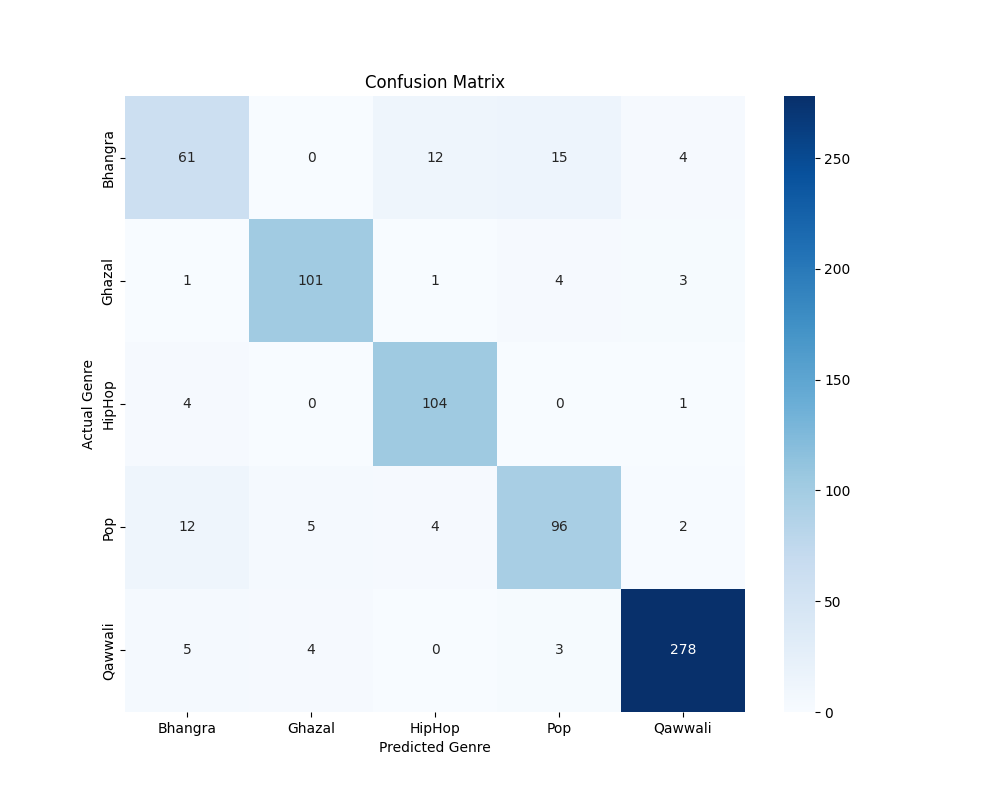
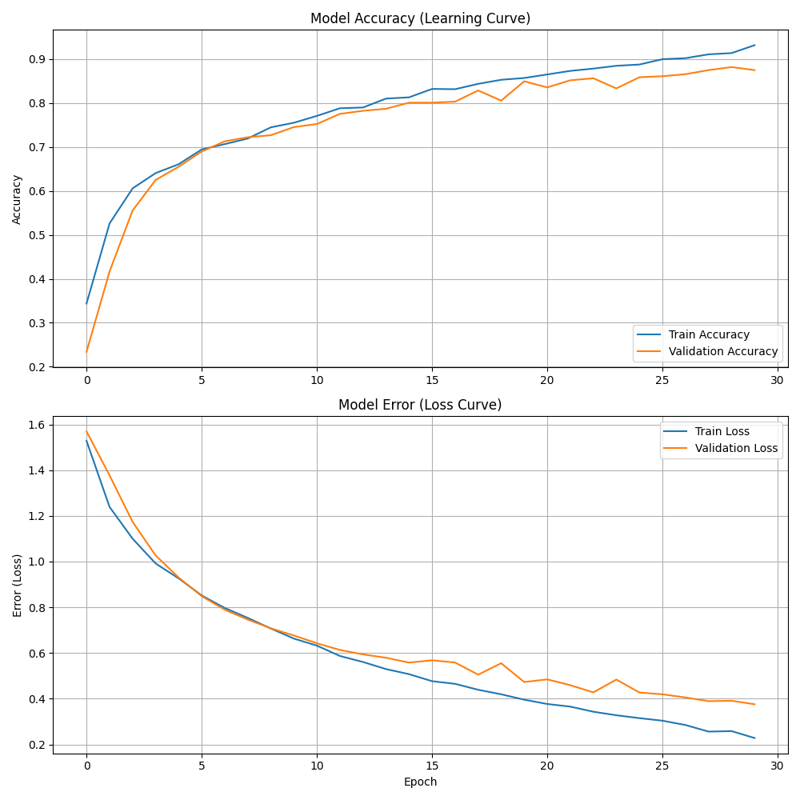

# SurTaal.AI: Regional Music Classification
**An End-to-End Deep Learning Solution for Pakistani Music**

SurTaal.AI bridges the gap in Western-centric audio classification by focusing on the unique rhythmic and melodic structures of Pakistani genres. This project leverages Deep Learning to classify audio into five distinct categories: **Bhangra, Ghazal, Hip-Hop, Pop, and Qawwali**.

---

### Technical Stack
- **AI Engine:** Python, TensorFlow/Keras (CNN Model).
- **Feature Engineering:** `Librosa` for MFCC (Mel-frequency cepstral coefficients) and spectral analysis.
- **Backend:** Flask (Python) for model serving and audio processing.
- **Frontend:** HTML5 & CSS3 Responsive UI.

---

### Project Architecture
- **`/src`**: Contains the core logic for feature extraction, model training, and performance evaluation.
- **`/web_app`**: The Flask deployment directory, including HTML templates and CSS assets.
- **`/results`**: Comprehensive evaluation metrics, including confusion matrices and learning curves.
- **`/models`**: Stores the pre-trained `pakistani_music_model.h5`.

---

### Performance & Visualization
The model was rigorously tested using k-fold cross-validation and visualized through confusion matrices to ensure precision across regional genres.

---

### Local Installation
1. **Clone the repository:** `git clone https://github.com/daimwithafullstop/SurTaal-AI`
2. **Install Dependencies:** `pip install -r requirements.txt`
3. **Run the App:** `python web_app/app.py`
